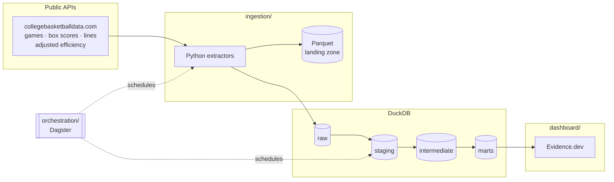

# Full Data Stack Lab

A living analytics engineering project demonstrating the full pipeline, raw
data to dashboard. Built to evolve.

It tracks every NCAA Division I men's basketball team through the season and
simulates the tournament at the end of it — and then reports how well its own
predictions did, which is the part most bracket models leave out.

**Cameron Spilker** · [cameronspilker.com](https://cameronspilker.com) ·
[cameron.spilker@outlook.com](mailto:cameron.spilker@outlook.com) ·
[LinkedIn](https://www.linkedin.com/in/cameronspilker)

---

## Architecture



| Layer         | Tool          | Why                                                                       |
| ------------- | ------------- | ------------------------------------------------------------------------- |
| Ingestion     | Python + httpx | One API and a handful of endpoints; a connector platform would be scaffolding around a 400-line problem. |
| Storage       | DuckDB        | Free, runs anywhere, read natively by Evidence, and small enough that a cloud warehouse would buy nothing but a logo. |
| Transformation | dbt Core     | Layered models, tests at every boundary, and metrics defined in code.     |
| Orchestration | Dagster       | Asset-oriented scheduling maps onto the dbt DAG, so lineage is one graph rather than two systems that must agree. |
| Presentation  | Evidence.dev  | Dashboards as code, versioned beside the models they read.                |
| CI/CD         | GitHub Actions | Free for public repos; runs the whole pipeline on every pull request.    |

## Repository layout

```
full-data-stack-lab/
├── ingestion/        # Python extractors
│   ├── seasons.yml   # The season registry — the one place seasons are added
│   └── src/ingestion/
├── transform/        # dbt project: staging → intermediate → marts
│   ├── models/
│   └── tests/        # Custom data-quality tests
├── orchestration/    # Dagster assets, jobs, schedules, sensor
├── dashboard/        # Evidence.dev project
├── data/             # DuckDB warehouse and Parquet landing zone
└── .github/workflows/
```

## Quickstart

```bash
python -m venv .venv && source .venv/bin/activate
pip install -e "ingestion[dev]" -r transform/requirements.txt
pip install -e orchestration          # optional: for Dagster

cp .env.example .env                  # add CBD_API_KEY for live data

# Populate the raw layer. `demo` simulates whole seasons — invented teams,
# invented results — so this works with no network and no API key.
ingest demo

# Before the first live run, check the sources actually return what the
# parsers expect. Writes nothing; exits non-zero if a critical field is empty.
ingest preflight --season 2026
ingest diagnose --season 2026         # why a preflight failed, if it did
ingest all --season 2026              # the real APIs

cd transform
export DBT_PROFILES_DIR=$PWD DUCKDB_PATH=../data/warehouse.duckdb
dbt deps && dbt build                 # 22 models, 111 tests
dbt docs generate && dbt docs serve
```

Then the dashboard:

```bash
cd dashboard
npm install
npm run sources && npm run dev        # http://localhost:3000
```

And the orchestrator:

```bash
export DAGSTER_HOME=$PWD/.dagster_home DBT_PROFILES_DIR=$PWD/transform
dagster dev -m full_data_stack_lab.definitions
```

## The data model

**Staging** — one model per source table, renamed and typed. `stg_ncaa__games`
also parses the postseason round out of the free-text note the source puts it
in, because every downstream model needs it and the wording has changed between
seasons.

**Intermediate** — `int_team_games` turns each game into two rows, one per
team, which is the shape every aggregate wants. `int_team_season_form` computes
record, splits, and a strength of schedule. `int_team_elo` computes Elo.
`int_team_prediction_inputs` gathers everything a prediction needs into one row
per team. `int_game_predictions` scores every completed game with every model.

**Marts** — `mart_team_season` (the team scoreboard), `mart_game_results` (the
game log), `mart_elo_timeline` (ratings over time), `mart_conference_strength`,
`mart_matchup_odds` (every possible pairing, priced), `mart_bracket` (a
projected 64-team field), `mart_tournament_odds` (the simulation), and
`mart_model_accuracy` / `mart_model_calibration` (the backtest).

**Semantic layer** — metrics like `average_efficiency_margin`,
`prediction_accuracy`, and `brier_score` are defined in
`models/marts/_semantic_models.yml`, so every consumer computes them the same
way instead of each dashboard rolling its own.

## Design decisions worth knowing

**One source, after two were tried.** ESPN's undocumented API was the first
implementation and was replaced by collegebasketballdata.com, which serves a
season per request instead of a scoreboard walked one date at a time and
carries betting lines. Barttorvik supplied the efficiency ratings until the
first live run: its CDN returns 403 to any request from a data centre, under
any User-Agent, so a scheduled pipeline could never read it. CBD publishes
adjusted efficiency itself, keyed on the same team id as everything else, so
the ratings now arrive over a join instead of a name match. Sportradar has
better data than any of them and was rejected: a trial key allows ~1,000
requests a month against a five-season backfill, and its licence restricts
redistributing data that this repo commits to a public warehouse.

**The API truncates at 3,000 records and does not say so.** A season-wide
request returns well-formed JSON that simply stops in early January, which is
the kind of failure that reaches a dashboard as confident wrong answers. Games
and lines are read in date windows, and any window that comes back exactly at
the limit is split and retried, so the paging adapts instead of trusting a
hand-picked window size. Box scores ignore the date parameters, so they are
walked one conference at a time and deduped.

**The betting line is the benchmark.** "The model went 71% straight up" mostly
measures whether favourites won. "The model beat the closing spread" is a
claim. The market consensus is loaded as a first-class model in
`int_game_predictions` and scored alongside the others.

**Some models are not allowed to claim they forecast.** The ratings feed
publishes a figure that describes a whole season. Scoring a January game with it means
using March information, and the resulting accuracy is meaningless as a
forecast. Rather than hide that model or pretend, every prediction carries an
`is_point_in_time` flag, and the dashboard separates on it. Elo is honest by
construction: its pregame rating was built only from games already played.

**Elo is the one model written in Python.** Everything else is SQL and should
be. Elo is irreducibly sequential — a team's rating depends on the result of
its previous game, for both teams — which in SQL is a recursive CTE tens of
thousands of levels deep. A loop is the honest shape of that computation.

**The tournament is simulated, not solved.** A team's chance of reaching the
Final Four depends on who else wins, which has no closed form. So the bracket
is played 20,000 times. Every probability it draws on comes from
`mart_matchup_odds`, built in SQL from a shared macro, so the bracket page and
the head-to-head numbers cannot disagree about the same game.

**Blowouts are capped.** A 40-point win says little more about team quality
than a 20-point win, so the strength-of-schedule maths uses a margin clamped to
±20 while the real margin stays available. Elo does the same thing differently,
with a concave margin-of-victory multiplier.

**The DuckDB file is committed — once it is real.** It holds only public data
and no credentials, so the daily pipeline commits the warehouse it builds and
the dashboard can then build from a clean checkout. Local builds are ignored by
git, because until the pipeline runs against the live APIs the file holds
synthetic `ingest demo` output, and fabricated numbers should never land in a
repository that is itself the portfolio piece.

## Synthetic data

`ingest demo` does not generate random numbers. It simulates seasons: every
team has a latent offensive and defensive strength, games are scored from those
strengths over a possession estimate, and the published ratings are those
strengths observed with noise. That matters because the marts backtest a
predictor — if scores and ratings were drawn independently, the model would
score no better than chance and a real modelling regression would be
indistinguishable from the fixture.

The teams are invented on purpose. Fabricated tournament odds attached to real
school names are the kind of thing that gets screenshotted and believed, so
nothing in the synthetic data shares a name with a real program.

## Secrets

`.env` is gitignored from the first commit; `.env.example` lists every variable
with no values. `CBD_API_KEY` is free and required only for live extracts — the
whole pipeline runs without it via `ingest demo`. In CI it lives in GitHub
Actions secrets and nowhere else.

## Deployment

The dashboard is a static site built from the published warehouse, hosted on
Vercel at a domain of its own. The dbt docs ship inside the same deployment at
`/docs`, so there is one thing to deploy and one place to look.

| Surface   | Path     |
| --------- | -------- |
| Dashboard | `/`      |
| dbt docs  | `/docs`  |

**Vercel project settings.** Root directory `dashboard`, build command
`npm run build:deploy`, output directory `build`. That build command fetches
the warehouse and the docs from the release below, then runs the normal
Evidence build. Every push redeploys, and so does every daily pipeline run,
because the run publishes a new warehouse rather than committing one.

**The warehouse is a release asset, not a commit.** It is a 17MB binary that
changes on every run even when no games were played, because every row carries
the timestamp it was extracted at. Committing it daily would add roughly its
own size to the repository's history every day, for a file git cannot diff and
nobody reads as text. The daily pipeline overwrites the `warehouse-latest`
release in place, and anything that needs the data downloads it:

```bash
curl -fsSL https://github.com/CameronSpilker/full-data-stack-lab/releases/download/warehouse-latest/warehouse.duckdb \
    -o data/warehouse.duckdb
```

`dashboard/scripts/fetch-warehouse.sh` is that download plus the docs, and it
is what `npm run build:deploy` calls. No credentials: the repository is public.

**Nothing is published until dbt passes.** The pipeline uploads the warehouse
only after `dbt build`, so a warehouse that failed its own tests is never the
one the dashboard builds from. The first live run stopped exactly there, on
eighteen games that had been recorded as completed 0-0.

**Hosting it somewhere else.** The build has no Vercel-specific parts: it is a
shell script, a static build, and a directory. GitHub Pages works too, and is
free for public repositories, but it serves a project site under `/<repo>`, so
set `deployment.basePath` in `dashboard/evidence.config.yaml` to
`/full-data-stack-lab` first.

## Status

Foundation complete: ingestion, the full dbt project with tests and metrics,
the Dagster asset graph, the Evidence dashboard, and CI all run end to end on
simulated seasons. Live API data, deployment, and hosted dbt docs are the next
steps — see `ROADMAP.md`.
