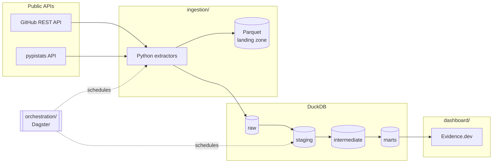

# Full Data Stack Lab

A living analytics engineering project demonstrating the full pipeline, raw
data to dashboard. Built to evolve.

It tracks the health and growth of the open-source analytics ecosystem using
public GitHub and PyPI data — the tools this project is built with, measured
with this project.

**Cameron Spilker** · [cameronspilker.com](https://cameronspilker.com) ·
[cameron.spilker@outlook.com](mailto:cameron.spilker@outlook.com) ·
[LinkedIn](https://www.linkedin.com/in/cameronspilker)

---

## Architecture



| Layer         | Tool          | Why                                                                       |
| ------------- | ------------- | ------------------------------------------------------------------------- |
| Ingestion     | Python + httpx | Two APIs and a handful of endpoints; a connector platform would be scaffolding around a 200-line problem. |
| Storage       | DuckDB        | Free, runs anywhere, read natively by Evidence, and small enough that a cloud warehouse would buy nothing but a logo. |
| Transformation | dbt Core     | Layered models, tests at every boundary, and metrics defined in code.     |
| Orchestration | Dagster       | Asset-oriented scheduling maps onto the dbt DAG, so lineage is one graph rather than two systems that must agree. |
| Presentation  | Evidence.dev  | Dashboards as code, versioned beside the models they read.                |
| CI/CD         | GitHub Actions | Free for public repos; runs the whole pipeline on every pull request.    |

## Repository layout

```
full-data-stack-lab/
├── ingestion/        # Python extractors for GitHub and PyPI
│   ├── tools.yml     # The tool registry — the one place tools are added
│   └── src/ingestion/
├── transform/        # dbt project: staging → intermediate → marts
│   ├── models/
│   ├── seeds/
│   └── tests/        # Custom data-quality tests
├── orchestration/    # Dagster assets, jobs, schedules, sensor
├── dashboard/        # Evidence.dev project
├── data/             # DuckDB warehouse and Parquet landing zone
└── .github/workflows/
```

## Quickstart

```bash
python -m venv .venv && source .venv/bin/activate
pip install -e "ingestion[dev]" dbt-duckdb
pip install -e orchestration          # optional: for Dagster

cp .env.example .env                  # optional: add a GITHUB_TOKEN

# Populate the raw layer. `demo` fabricates deterministic synthetic history so
# this works with no network and no API budget; `all` hits the real APIs.
ingest demo

cd transform
export DBT_PROFILES_DIR=$PWD DUCKDB_PATH=../data/warehouse.duckdb
dbt deps && dbt build                 # 6 models, 1 seed, 87 checks
dbt docs generate && dbt docs serve
```

Then the dashboard:

```bash
cd dashboard
npm install
npm run sources && npm run dev        # http://localhost:3000
```

And the orchestrator:

```bash
export DAGSTER_HOME=$PWD/.dagster_home DBT_PROFILES_DIR=$PWD/transform
dagster dev -m full_data_stack_lab.definitions
```

## The data model

**Staging** — one model per source table, renamed and typed, nothing more.
`stg_github__releases` and `stg_pypi__downloads` also deduplicate: both
endpoints re-report the same history on every run.

**Intermediate** — `int_repos_weekly` and `int_packages_weekly` roll snapshots
up to weeks and compute the week-over-week deltas every mart needs, so the
delta logic is written once.

**Marts** — `mart_ecosystem_growth` (the growth series), `mart_tool_comparison`
(head-to-head standing per category), `mart_release_cadence` (how actively each
tool ships), `mart_contributor_health` (community signals).

**Semantic layer** — metrics like `weekly_star_growth_rate`,
`download_momentum`, and `stars_per_contributor` are defined in
`models/marts/_semantic_models.yml`, so every consumer computes them the same
way instead of each dashboard rolling its own.

## Design decisions worth knowing

**GitHub reports state, not history.** The API returns current star counts with
no time series, so history is built by appending one dated snapshot per run.
That makes the ingestion schedule part of the data model: a missed week is a
missing row, not a gap that can be backfilled later.

**PyPI is the opposite.** pypistats returns a trailing 180-day window on every
call, so the same day arrives many times. The staging layer keeps the most
recent observation of each day and the intermediate layer flags partial weeks
rather than dropping them, so a chart can exclude them without losing the row.

**Contributor counts are a floor.** GitHub's paginated contributor list caps at
500. Rather than quietly reporting a wrong number, `is_count_capped` travels
all the way to the dashboard.

**Stars can fall, but not far.** A custom test fails the run if any tool's star
count drops more than 10% week over week — real ecosystems don't move like
that, so it is far likelier to be a bad extract, and it should never reach a
dashboard.

**The DuckDB file is committed — once it is real.** It holds only public data
and no credentials, so the weekly pipeline commits the warehouse it builds and
the dashboard can then build from a clean checkout. Local builds are ignored by
git, because until the pipeline runs against the live APIs the file holds
synthetic `ingest demo` output, and fabricated numbers should never land in a
repository that is itself the portfolio piece.

## Secrets

`.env` is gitignored from the first commit; `.env.example` lists every variable
with no values. `GITHUB_TOKEN` is optional — it only raises the rate limit from
60 to 5,000 requests per hour, and needs no scopes because this project reads
public data. In CI it lives in GitHub Actions secrets and nowhere else.

## Status

Foundation complete: ingestion, the full dbt project with tests and metrics,
the Dagster asset graph, the Evidence dashboard, and CI all run end to end.
Live API data, deployment, and hosted dbt docs are the next steps — see
`ROADMAP.md`.
