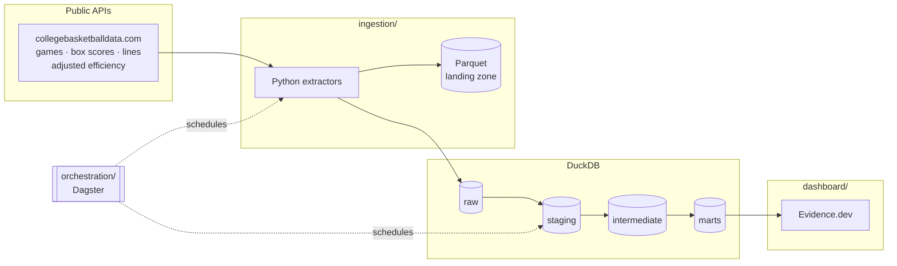

# Full Data Stack Lab

A living analytics engineering project demonstrating the full pipeline, raw
data to dashboard. Built to evolve.

It tracks every NCAA Division I men's basketball team through the season and
simulates the tournament at the end of it — and then reports how well its own
predictions did, which is the part most bracket models leave out.

**Cameron Spilker** · [cameronspilker.com](https://cameronspilker.com) ·
[cameron.spilker@outlook.com](mailto:cameron.spilker@outlook.com) ·
[LinkedIn](https://www.linkedin.com/in/cameronspilker)

---

## Architecture



| Layer         | Tool          | Why                                                                       |
| ------------- | ------------- | ------------------------------------------------------------------------- |
| Ingestion     | Python + httpx | One API and a handful of endpoints; a connector platform would be scaffolding around a 400-line problem. |
| Storage       | DuckDB        | Free, runs anywhere, read natively by Evidence, and small enough that a cloud warehouse would buy nothing but a logo. |
| Transformation | dbt Core     | Layered models, tests at every boundary, and metrics defined in code.     |
| Orchestration | Dagster       | Asset-oriented scheduling maps onto the dbt DAG, so lineage is one graph rather than two systems that must agree. |
| Presentation  | Evidence.dev  | Dashboards as code, versioned beside the models they read.                |
| CI/CD         | GitHub Actions | Free for public repos; runs the whole pipeline on every pull request.    |

## Repository layout

```
full-data-stack-lab/
├── ingestion/        # Python extractors
│   ├── seasons.yml   # The season registry — the one place seasons are added
│   └── src/ingestion/
├── transform/        # dbt project: staging → intermediate → marts
│   ├── models/
│   └── tests/        # Custom data-quality tests
├── orchestration/    # Dagster assets, jobs, schedules, sensor
├── dashboard/        # Evidence.dev project
├── data/             # DuckDB warehouse and Parquet landing zone
└── .github/workflows/
```

## Quickstart

```bash
python -m venv .venv && source .venv/bin/activate
pip install -e "ingestion[dev]" -r transform/requirements.txt
pip install -e orchestration          # optional: for Dagster

cp .env.example .env                  # add CBD_API_KEY for live data

# Populate the raw layer. `demo` simulates whole seasons — invented teams,
# invented results — so this works with no network and no API key.
ingest demo

# Before the first live run, check the sources actually return what the
# parsers expect. Writes nothing; exits non-zero if a critical field is empty.
ingest preflight --season 2026
ingest diagnose --season 2026         # why a preflight failed, if it did
ingest all --season 2026              # the real APIs

cd transform
export DBT_PROFILES_DIR=$PWD DUCKDB_PATH=../data/warehouse.duckdb
dbt deps && dbt build                 # 24 models, 132 tests
dbt docs generate && dbt docs serve
```

Then the dashboard:

```bash
cd dashboard
npm install
npm run sources && npm run dev        # http://localhost:3000
```

And the orchestrator:

```bash
export DAGSTER_HOME=$PWD/.dagster_home DBT_PROFILES_DIR=$PWD/transform
dagster dev -m full_data_stack_lab.definitions
```

## The data model

**Staging** — one model per source table, renamed and typed. `stg_ncaa__games`
also parses the postseason round out of the free-text note the source puts it
in, because every downstream model needs it and the wording has changed between
seasons.

**Intermediate** — `int_team_games` turns each game into two rows, one per
team, which is the shape every aggregate wants. `int_team_season_form` computes
record, splits, and a strength of schedule. `int_team_elo` computes Elo.
`int_team_prediction_inputs` gathers everything a prediction needs into one row
per team. `int_team_forecast_inputs` narrows that to what is known about a team
right now, which is a different question in November.
`int_game_predictions` scores every completed game with every model.

**Marts** — `mart_team_season` (the team scoreboard), `mart_game_results` (the
game log), `mart_elo_timeline` (ratings over time), `mart_conference_strength`,
`mart_matchup_odds` (every possible pairing, priced), `mart_bracket` (a
projected 64-team field), `mart_tournament_odds` (the simulation),
`mart_upcoming_games` (the games that have not been played yet, priced against
the market), and `mart_model_accuracy` / `mart_model_calibration` (the
backtest).

**Semantic layer** — metrics like `average_efficiency_margin`,
`prediction_accuracy`, and `brier_score` are defined in
`models/marts/_semantic_models.yml`, so every consumer computes them the same
way instead of each dashboard rolling its own.

## Design decisions worth knowing

**One source, after two were tried.** ESPN's undocumented API was the first
implementation and was replaced by collegebasketballdata.com, which serves a
season per request instead of a scoreboard walked one date at a time and
carries betting lines. Barttorvik supplied the efficiency ratings until the
first live run: its CDN returns 403 to any request from a data centre, under
any User-Agent, so a scheduled pipeline could never read it. CBD publishes
adjusted efficiency itself, keyed on the same team id as everything else, so
the ratings now arrive over a join instead of a name match. Sportradar has
better data than any of them and was rejected: a trial key allows ~1,000
requests a month against a five-season backfill, and its licence restricts
redistributing data that this repo commits to a public warehouse.

**The API truncates at 3,000 records and does not say so.** A season-wide
request returns well-formed JSON that simply stops in early January, which is
the kind of failure that reaches a dashboard as confident wrong answers. Games
and lines are read in date windows, and any window that comes back exactly at
the limit is split and retried, so the paging adapts instead of trusting a
hand-picked window size. Box scores ignore the date parameters, so they are
walked one conference at a time and deduped.

**Losing one season is a log line. Losing all of them is a failure.** Each
extractor loses a season the same way: it logs the error and carries on, so one
bad response cannot cost the other four. The first successful backfill showed
what that costs when it is the only rule. CBD rate limited every historical
request, both the lines and the ratings extractors lost all five seasons, and
the run published a warehouse with five seasons of games and one of everything
else while reporting success. Every extractor now counts its losses and raises
`SourceExhausted` when not one season came back, which fails the run before it
publishes and leaves yesterday's complete warehouse standing. A 429 also no
longer spends a retry: five backoffs totalling thirty-one seconds were shorter
than the window the limit is measured over, so every retry arrived still
throttled. And a backfill asks more slowly than a daily run, because nobody is
waiting on it.

**A forecast of a game that has not been played is the only honest one.**
Every other prediction in this project is graded, which is what makes the
`is_point_in_time` flag necessary: a January game scored with a season-long
rating was told the answer. `mart_upcoming_games` cannot have that problem,
because the game has no result to leak. What it has instead is no way to check
itself, so it ships beside two things that can be checked: the observed win
rate of real forecasts at the same confidence, taken from the calibration
table, and the price the betting market is charging for the same side. A pick
that agrees with the market has found nothing, so the page leads on
disagreement rather than on confidence.

**A rating from four games is mostly noise, and on opening night there is
none.** Every model that reads `int_team_prediction_inputs` is fine with that,
because it is describing a season that finished. A forecast made on the second
Tuesday in November is not: there is barely an Elo, and the ratings feed has
nothing to describe. `int_team_forecast_inputs` starts each team on what it
carried out of last season, regressed toward the league average of that
season, and hands weight to the current season as the current season earns it,
reaching full weight at ten games. Every row says which of the three cases it
is in, so nothing downstream has to guess whether a November number is built
on this season's evidence.

**The betting line is the benchmark.** "The model went 71% straight up" mostly
measures whether favourites won. "The model beat the closing spread" is a
claim. The market consensus is loaded as a first-class model in
`int_game_predictions` and scored alongside the others.

**Some models are not allowed to claim they forecast.** The ratings feed
publishes a figure that describes a whole season. Scoring a January game with it means
using March information, and the resulting accuracy is meaningless as a
forecast. Rather than hide that model or pretend, every prediction carries an
`is_point_in_time` flag, and the dashboard separates on it. Elo is honest by
construction: its pregame rating was built only from games already played.

**Elo is the one model written in Python.** Everything else is SQL and should
be. Elo is irreducibly sequential — a team's rating depends on the result of
its previous game, for both teams — which in SQL is a recursive CTE tens of
thousands of levels deep. A loop is the honest shape of that computation.

**The tournament is simulated, not solved.** A team's chance of reaching the
Final Four depends on who else wins, which has no closed form. So the bracket
is played 20,000 times. Every probability it draws on comes from
`mart_matchup_odds`, built in SQL from a shared macro, so the bracket page and
the head-to-head numbers cannot disagree about the same game.

**Blowouts are capped.** A 40-point win says little more about team quality
than a 20-point win, so the strength-of-schedule maths uses a margin clamped to
±20 while the real margin stays available. Elo does the same thing differently,
with a concave margin-of-victory multiplier.

**The warehouse is published, not committed.** It holds only public data and no
credentials, so it could go in git, and it should not: it is a 17MB binary that
changes on every run even when nothing was played, because every row carries
the time it was extracted. A daily commit would add its own size to the
repository's history every day, for a file nobody reads as text and git cannot
diff. The pipeline uploads it to the `warehouse-latest` release instead,
overwriting in place, and the dashboard build fetches it from there. It is
published only after `dbt build` passes, so the dashboard is never built from a
warehouse that failed its own tests.

**Not every finished game was played.** The source calls a row final whenever
it comes off the schedule, and that sweeps in fixtures nobody played:
cancellations left at 0-0, the administrative 2-0 the NCAA records for a
forfeit (seventeen of them across the COVID seasons), and three records where
one side's score is missing digits. Each is a true row about the season and a
false one about basketball, so `stg_ncaa__games` labels them in
`scoring_status` and holds them out of `is_completed` rather than deleting
them. The bounds live in `dbt_project.yml`, which is also where
`assert_scores_are_plausible` reads them, so the rule and the test that guards
it cannot drift apart.

**A rating the source cannot mean is dropped, not clamped.** CBD publishes
Pittsburgh's 2023 season at a 160.4 offensive efficiency and five teams at
tempos in the thirties and forties. Nothing in basketball produces those
numbers, and rounding them into range would invent a season.
`stg_ncaa__ratings` nulls them and flags the row, and a warning prints what the
source said, so a prediction goes missing instead of going wrong and the count
stays visible in the build log.

**Division I only, but every opponent counts.** Roughly 350 of the teams in the
game data are November buy-game opponents: NAIA schools, Bible colleges, a few
Division III programmes. Those games happened, and they belong in a Division I
team's strength of schedule, so `int_team_season_form` rates them. They stop at
`int_team_prediction_inputs`, which joins the team dimension, so they never
reach a national rank or a "teams tracked" figure.

## Synthetic data

`ingest demo` does not generate random numbers. It simulates seasons: every
team has a latent offensive and defensive strength, games are scored from those
strengths over a possession estimate, and the published ratings are those
strengths observed with noise. That matters because the marts backtest a
predictor — if scores and ratings were drawn independently, the model would
score no better than chance and a real modelling regression would be
indistinguishable from the fixture.

A simulated season is played in full and then published only as far as an
as-of date. Games after it come out the way a real source gives an unplayed
fixture: on the schedule, with no score. Future postseason games are not
published at all, because a bracket is not scheduled until the regular season
decides who is in it. That is what gives `mart_upcoming_games` something to
forecast, and it means the forecast page has rows before a real season has
started. The date is today when today falls inside the current season, and
otherwise a point in the middle of conference play, so a demo run in July still
has a slate ahead of it. `ingest demo --as-of 2026-03-01` sets it explicitly.

Betting lines only exist for games already played and for the next week of the
schedule, because that is as far ahead as a book posts. Most of the schedule is
therefore unpriced, which is the case every consumer of a line has to handle.

The teams are invented on purpose. Fabricated tournament odds attached to real
school names are the kind of thing that gets screenshotted and believed, so
nothing in the synthetic data shares a name with a real program.

## Light and dark

The dashboard follows the reader's operating system by default, and remembers a
different choice if they make one. `appearance` in `dashboard/evidence.config.yaml`
turns Evidence's own switcher on: it is the Appearance item in the header menu,
or Ctrl/Cmd + Shift + L.

The default is `system` rather than `dark` on purpose. Evidence stamps the
resolved appearance on the page from a script that runs before the first paint,
and that script assumes `system` when nothing is stored yet, so any other
default shows one frame of the wrong palette on a first visit.

cameronspilker.com, which links here, is set up the same way: same default,
same three settings.

## Secrets

`.env` is gitignored from the first commit; `.env.example` lists every variable
with no values. `CBD_API_KEY` is free and required only for live extracts — the
whole pipeline runs without it via `ingest demo`. In CI it lives in GitHub
Actions secrets and nowhere else.

## Deployment

The dashboard is a static site built from the published warehouse, hosted on
Vercel at a domain of its own. The dbt docs ship inside the same deployment at
`/docs`, so there is one thing to deploy and one place to look.

| Surface   | Path     |
| --------- | -------- |
| Dashboard | `/`      |
| dbt docs  | `/docs`  |

**Vercel project settings.** Root directory `dashboard`; everything else is in
`dashboard/vercel.json` and `dashboard/package.json`, so the build is described
in the repository rather than in a control panel nobody can diff. `engines.node`
pins Node 22 there, matching CI: the DuckDB driver Evidence uses publishes no
prebuilt binary for Node 24, and without the pin a host defaulting to 24 tries
to compile DuckDB from source and fails. The build command fetches the
warehouse and the docs from the release below, then runs the normal Evidence
build. Every push redeploys, and so does every daily pipeline run,
because the run publishes a new warehouse rather than committing one.

**The warehouse is a release asset, not a commit.** It is a 17MB binary that
changes on every run even when no games were played, because every row carries
the timestamp it was extracted at. Committing it daily would add roughly its
own size to the repository's history every day, for a file git cannot diff and
nobody reads as text. The daily pipeline overwrites the `warehouse-latest`
release in place, and anything that needs the data downloads it:

```bash
curl -fsSL https://github.com/CameronSpilker/full-data-stack-lab/releases/download/warehouse-latest/warehouse.duckdb \
    -o data/warehouse.duckdb
```

`dashboard/scripts/fetch-warehouse.sh` is that download plus the docs, and it
is what `npm run build:deploy` calls. No credentials: the repository is public.

**Nothing is published until dbt passes.** The pipeline uploads the warehouse
only after `dbt build`, so a warehouse that failed its own tests is never the
one the dashboard builds from. The first live run stopped exactly there, on
eighteen games that had been recorded as completed 0-0.

**Hosting it somewhere else.** The build has no Vercel-specific parts: it is a
shell script, a static build, and a directory. GitHub Pages works too, and is
free for public repositories, but it serves a project site under `/<repo>`, so
set `deployment.basePath` in `dashboard/evidence.config.yaml` to
`/full-data-stack-lab` first.

## Status

Foundation complete: ingestion, the full dbt project with tests and metrics,
the Dagster asset graph, the Evidence dashboard, and CI all run end to end on
simulated seasons. Live API data, deployment, and hosted dbt docs are the next
steps — see `ROADMAP.md`.
